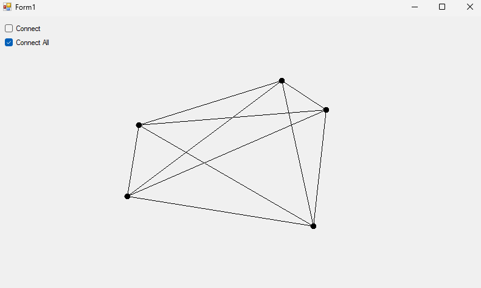

# WinForms-PointConnector

*A minimal C# /.NET Windows Forms application for quickly sketching connected point diagrams.*

## Features
- **Click-to-plot:** Left-click anywhere in the form to add a point marker.  
- **Instant clearing:** Right-click to clear all points and start fresh.  
- **Two connection modes**  
  - **Connect** – joins points in the order you placed them and closes the loop.  
  - **Connect All** – draws a line between **every** pair of points (a complete graph).  
- **Mutual-exclusion logic** prevents selecting both modes at once.

### Prerequisites
- Visual Studio 2022 (or later) with **.NET Desktop Development** workload  
- .NET Framework 4.8 (or adjust the target to any version that supports Windows Forms)
